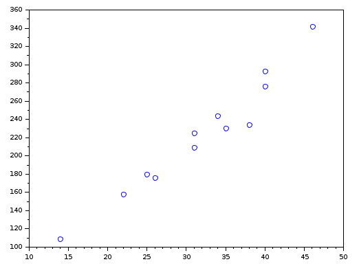
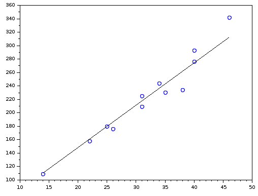

# SAE 2.04 - Exploitation d'une base de données  

## 7 - Analyse Statistique Mathématique

## 1) Extraire de la base le nombre de ventes effectuées en 2022 par mois, vous obtenez un premier jeu de 12 valeurs noté V.

Voici la requête associée au jeu de données :  
```sql
create or replace view PRIXVENTE as
SELECT DISTINCT idve, idUt idacheteur, max(montant) montant
FORM VENTE NATURAL JOIN STATUT NATURAL JOIN ENCHERIR
WHERE nomSt = "Validée"
GROUP BY idve
ORDER BY Mois ASC;

SELECT MONTH(finVe) Mois, count(idVe)
FROM PRIXVENTE NATURAL JOIN VENTE
where year(finVe) = 2022
GROUP BY Mois;
```
Cette requête nous permet alors d'obtenir les valeurs suivantes :  
| Mois | count(idVe) |
|------|-------------|
|    1 |          14 |
|    2 |          25 |
|    3 |          22 |
|    4 |          40 |
|    5 |          31 |
|    6 |          31 |
|    7 |          35 |
|    8 |          46 |
|    9 |          40 |
|   10 |          38 |
|   11 |          34 |
|   12 |          26 |  

Tout au long de cette étude, on utilisera le logiciel SCILAB pour nous aider à calculer et représenter l'ensemble des valeurs demandées. 

Pour mettre en place l'ensemble des données sur SCILAB, on défini celui par V = [14,25,22,40,31,31,35,46,40,38,34,26].  
Une fois l'ensemble crée, on peut alors calculer trois valeurs importantes :
- La moyenne de V, noté $\bar{V}$ ce calcule par  $\frac{1}{N}$ $\sum_{i=1}^{N} V_i$. Elle se calcule à l'aide de la commande mean(V) sur SCILAB.
La moyenne de V est égale 31.833333.
- La médiane de V, est la valeur telle que 50 % des unités ont une valeur inférieure ou égale à la médiane et 50 % des unités ont une valeur supérieure ou égale.
Elle se calcule à l'aide de la commande median(V). La médiane de V est égale à 32.5.
- Le mode de V, est la (ou les) valeurs qui possède(nt) la plus grande fréquence d'apparition.
Pour définir celui-ci, on peut utiliser un graphe de fréquence par le fait que le jeu de données est petit.
Sur SCILAB, on peut donc défnir le script suivant ;
```
N = length(V)
m = tabul(V,'i')
x = m(:,1)
n = m(:,2)
f = n/N
bar(x,n)
```
m est la table des fréquences, x représente les modalités dépouillés, n l'effectif, et f les fréquences.  
Une fois l'ensemble des données calculées, on affiche le graphe ci-dessous grâce à la commande bar(x,n). On trouve que le mod est alors 31 et 40.  


## 2) Extraire le nombre d’enchêres de 2022 par mois, ces valeurs constituent une seconde statistique notée E. Vous obtenez ainsi la statistique double (V, E). Tracez le nuage de points (V, E) :  
Un nouvel ensemble de données noté E est créer, il sera caractérisé par la requête suivante :  
```sql
select MONTH(finVe) Mois, count(dateHeure)
from ENCHERIR natural join VENTE
where year(finVe) = 2022
group by Mois
order by Mois ASC;
```
On obtient pour résultat la table suivante :  

| Mois | count(dateHeure) |
|------|------------------|
|    1 |              109 |
|    2 |              180 |
|    3 |              158 |
|    4 |              276 |
|    5 |              225 |
|    6 |              209 |
|    7 |              230 |
|    8 |              342 |
|    9 |              293 |
|   10 |              234 |
|   11 |              244 |
|   12 |              176 |

De la même manière que tout à l'heure, on peut convertir ses données en un ensemble E = [109,180,158,276,225,209,230,342,293,234,244,176]  
On peut alors désormais tracer un nuage de point grâce à la commande scatter(V,E), qui affiche le graphique ci-dessous :  

On peut visuellement voir apparaitre une corrélation linéaire entre V et E, par le fait qu'une droite ce trace plutôt naturellement entre les points du nuage.  

Le coefficient de corrélation ce calcule de manière suivante : $\frac{corr(E,V,1)}{sqrt(variance(E)*variance(V))}$  
Définissons alors la variance ainsi que la covariance pour mieux comprendre le coefficient de corrélation :  

- La variance, noté Var(V), ce calcule par ($\bar{V²}$ - ($\bar{V}$)²). Elle correspond à l’écart quadratique moyen de V centrée en $\bar{V}$.
- La covariance quand à elle, correspond à la relation entre deux variables. Noté Cov(X,Y), elle ce calcule par $\frac{1}{N}$ $\sum_{i=1}^{N} (X_i- X̄)(Y_i- Ɏ)$

Le coefficient de corrélation est donc égal à 506.33333/sqrt(3996.3636*80.333333 ) = 0.8936267   

Que peut-on en déduire ?
Ici le coefficient étant proche de 1, on peut dire que la corrélation linéaire vu précédemment entre V et E est donc réel, car elle est prouvé mathématiquement à l'aide de ce coefficient.


## 3) En vous servant de la question précédente, quel nombre de ventes (sur un mois donné) anticipez vous si le nombre d’enchères sur ce même mois est de 285.


Pour pouvoir retrouver l'antécédent d'un nuage de point, il faut alors transformer celui-ci en une droite. Pour cela on utilise ce qu'on appelle droite de régression.  
La droite de régression est la droite qu'on peut tracer dans le nuage de points qui représente le mieux la distribution à deux caractères étudiée.
```
//Calcul de la droite de régression (sous forme ax + b)
scatter(V,E)
a = corr(V,E,1)/variance(V)
b = mean(E) - a*mean(V)
plot2d(V,a*V+b)
```

  

Grâce à ce script SCILAB, on peut alors trouver que la droite de régression est égale à 6.3029046x + 22.357538
On connais donc f(x), ou b = 285
6.3029046x + 22.357538 = 285
6.3029046x  = 285 - 22.357538
x = (285 - 22.357538)/6.3029046
x = 41.670067797
Si le nombre d'enchère sur un mois donné est de 285, on peut alors prévoir qu'environ 42 ventes serons effectuer pendant ce même mois.

## Par Ludmann Dorian 1.3b